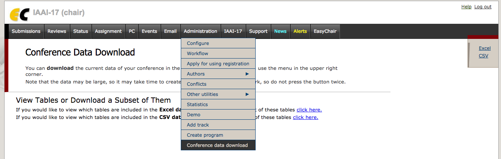

# IAAI-EasyChair-CSV-Paper-Score-Processor
This is a script for processing an EasyChair CSV bundle to tally and average a set of custom scores. Used specifically for the Innovative Applications of Artificial Intelligence (IAAI) Conference.

Before use:

1. Edit the *process_iaai_scores.py* file to customize to your purpose

Assumptions:

1. The review file is named *review.csv*
2. The score file is named *review_score.csv*
3. The output file will be named *iaai_scoring_output.csv*
4. The minumum number of reviews is **3**

Usage:

1. Get the CSV bundle download on the *Administration > Conference data download* page by clicking/tapping the *CSV* on the upper right section as shown below.


2. Unzip that CSV bundle.
3. Copy the *process_iaai_scores.py* into the CSV bundle folder
4. Open a terminal program and execute the following

```
machine:folder user$ python process_iaai_scores.py
```

----
This software is licensed under Creative Commons Attribution-ShareAlike 4.0 International (CC BY-SA 4.0)


